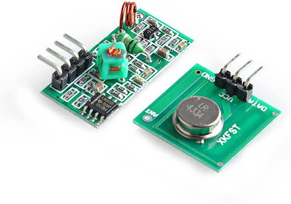

# 433mhz temperature sensors

I had a chat with a friend of a friend during Christmas time about a correlation of outside temperature and the natural gas bill and how good it would be to forecast these things. After this conversation, I thought that it would be great to collect temperatures in the different places in the house. The main reason for this is that the house is not as warm as I would want and when we insulate it we need to have numbers to compare. "It's got a bit warmer" sounds a way too subjective. 

## Sensors

I was looking for something that can be connected to and controlled by raspberry pi which I already got. After a bit of googling, I went for this [sensor](https://www.banggood.com/Digoo-DG-R8H-433MHz-Wireless-Digital-Hygrometer-Thermometer-Weather-Station-Sensor-for-TH11300-8380-p-1178108.html) mostly because it is cheap, there is no problem how to power it and there are open source libraries that can decode signal from the sensor.

## 433mhz receiver 

I left buying receiver until the very end because I have seen there are quite a lot available on Amazon. However, to my surprise, it took me almost two weeks to find the receiver that would work adequately. 

 

This one was  receiving a signal in a range of 1m.

 

This one I haven't been able to get working at all. 

The one that I eventually used for this project is RXB6 433Mhz Superheterodyne Wireless Receiver

## Raspberry pi and configuration

This was probably the easiest part of the project. Mostly because there is a brilliant [guide](https://github.com/aquaticus/nexus433) from [aquaticus](https://github.com/aquaticus) which has a step-by-step instruction and great explanation of how to connect 433mhz receiver and configure a service for decoding sensors signal. 

There are a couple of things I want to mention here. the first one is that I had a problem to configure `libgpiod` library because of the missing Linux kernel headers. There are workarounds described in this [issue](https://github.com/aquaticus/nexus433/issues/21) and they worked for me.

Another thing is that if somehow you would get hold of *Digoo DG-R8S 433MHz* (on the picture above) it won't work out of the box because it uses different protocol but there is a [PR](https://github.com/aquaticus/nexus433/pull/16) that works for  *Digoo DG-R8S 433MHz* and for *Digoo-DG-R8H 433MHz* sensors.

## Grafana Dashboard 

When everything was wired and configured I hooked it up to [homeassistant](https://www.home-assistant.io/) and it looked pretty cool! 

However, I wanted my dashboard to be a bit more flexible and I wanted to have all sensors temperatures on one graph. I couldn't quickly find how to do it in the *homeassistant* (or, what is more likely, I just wanted to play with [grafana](https://github.com/grafana/grafana)) so I started exploring how I can present this data on grafana dashboard. I have to mention that I have never configured grafana before this so I am sure many things can be done better or in a more straightforward way but I learned as I went.  

I set the following requirements to my dashboard:

  1. All sensor data needs to be stored and not only last 24hr or 3 days.

  2. I need to get an outside temperature for my location (I wasn't keen on leaving the temperature sensor outside because I wasn't sure it would survive rain). 
  
  3. Data graph should be easy to configure.
  
  4. Everything should work on raspberry pi. 

The main grafana how to source for me was this [post](https://mostlyoperational.com/posts/2017-12-28_monitoring-your-home-network-with-influxdb-on-raspberry-pi-with-docker/) This post gives the idea how to set up Grafana + Influx + Telegraf. I included docker compose file in this repository with all configuration I have. This is how my temperature dashboard looks like now

Couple of things, which I think, is worth mentioning is that I configured Telegraf MQTT input plugin to collect data from sensors and push them into InfluxDB. I also added two ruby scripts. One to get an outside temperature from [Weather API](https://openweathermap.org/api) and then publish it to MQTT broker. Another one for testing internet bandwidth using speedtest.net and then publish results to MQTT. The last thing I want to mention here is that I tried to wrap [nexus433 service](https://github.com/aquaticus/nexus433) into docker container but due to lack of knowledge I haven't been able to complete it. 

## Antenna

You can see some gaps on the graph above and it's happening because the signal from the sensor can't reach the receiver. I was trying to move sensors around to solve this problem but this strategy was neither effective nor sustainable so I eventually created a simple  [17.3 cm antenna](https://dronebotworkshop.com/433mhz-rf-modules-arduino/). It solved problem of lost sigmnals from some sensors. 